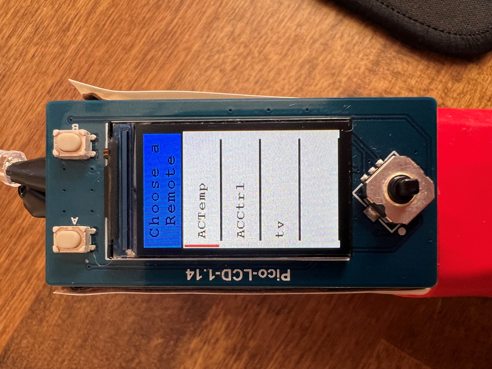
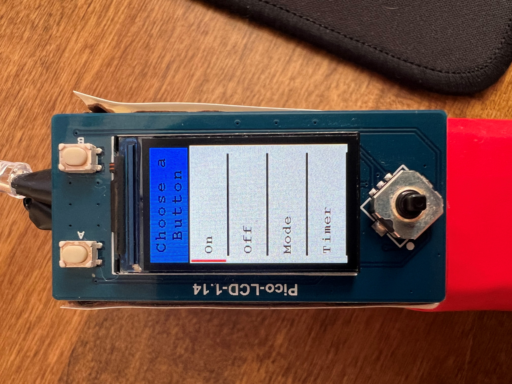
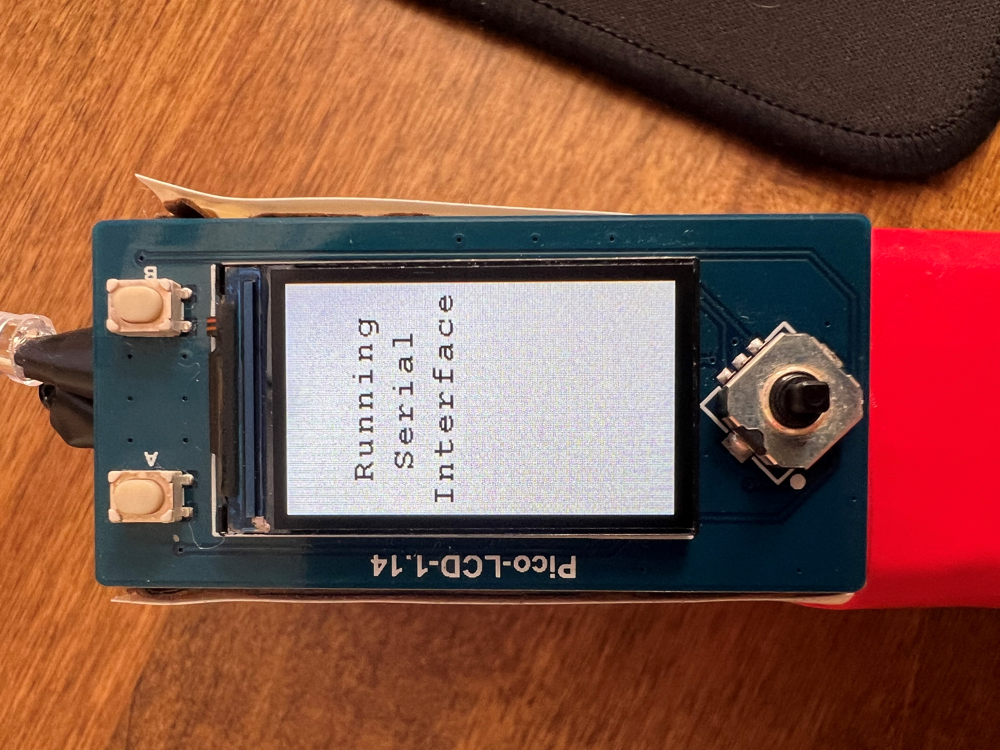

## High Level Design

Every decision made in the creation of this project was geared towards ensuring its usability in the real world. In our project proposal we envisioned a remote the size of any average TV remote that could replace the devices that control anything from LED light strips to air conditioning units. We knew that the range of infrared communication protocols used would cause issues if we were not clever about how we recorded the signals. We also knew that it was not feasible to add a small keyboard to the device itself given the time constraints of the project, so a serial interface needed to be developed for the programming of buttons and remotes. We also strongly wanted this device to be able to be used in our homes, and that objective drove our implementation decisions of what the user interface looks like, how we store the user’s data, and how it is powered. 

### Design Tradeoffs

Since this idea had no advanced circuitry, most of the development time was spent on the software. The communication between the Raspberry Pi Pico and the LCD screen and SD card was done over the two SPI channels natively supported by the Pico. We also decided that a serial interface over UART was the most feasible way to allow the user to type in names for buttons and remotes. This simplified the wiring considerably but meant that extensive software development was needed. 

### Infrared Communications

INSERT

### Serial Interface

INSERT

### User Interface

The desire for practicality limited the size of screen and buttons that we could use in our design. We selected an LCD screen and button set that has been adapted to be used specifically with the Raspberry Pi Pico because of its compact size and preexisting C library. This specific display communicates over SPI, and it uses the SPI1 channel on the Pico. The buttons each have their own GPIO pin which means that, by the final implementation, we have used almost all of the pins of the Pico, but it also means that we do not need any additional logic or hardware to work with the buttons.

The digital interface design was developed to be as clear and streamlined as possible. This means that there are only four main display states. The first display state is the boot screen. This screen lets the user know that the device is running, and it also buys time for the SD card to read all the data before needing to display it. 


The next screen displayed allows the user to navigate through their programmed remotes. This “Choose a Remote” screen uses a small red bar on the left-hand side of the screen to show which remote is selected. If there are more than one remote, the user may scroll to their desired remote using up and down on the joystick. The user can then press in or right on the joystick to progress to the buttons stored in the highlighted remote.



Once the user has selected their remote and advanced to the buttons within that selection, the “Choose a Button” screen allows the user to highlight the desired button with the same technique as the “Choose a Remote” screen. If the user wants to broadcast the signal of one of these buttons, they may highlight the button and press the “A” button on the top left of the display plate. If they do not want to broadcast any of these buttons, they may go back to the “Choose a Remote” screen by pressing left on the joystick.



If at any point the user wants to program a new button or remote, they may press the “B” button on the top right of the display plate. This will display the “Running Serial Interface” screen and prevent the user from interacting with the LCD. All the user input will then be handled by the serial interface on a computer.



### Data Storage

All data management with the SD card is handled behind the scenes so that the user can simply enjoy using the product. Upon powering the device, all the data is read from the SD card to the Pico, and the data will never be read from the SD card again while the device is powered. The data is written to the SD card any time the user changes something through the serial interface. This limited data handling ensures that all transactions are secure, and no data is lost. 

Since we chose to use an SD card as our non-volatile memory solution, there is no concern of storing too much data. The only issue presented by the SD card is the strict communication requirements. To accomplish this system, we used an existing C library that can handle all FAT32 file transactions with the SD card over SPI. Although SPI is a slower method of communicating with an SD card, the protocol is significantly less complicated and suits our needs more appropriately.

## Blockquotes

### Single line

> My mom always said life was like a box of chocolates. You never know what you're gonna get.

### Multiline

> What do you get when you cross an insomniac, an unwilling agnostic and a dyslexic?
>
> You get someone who stays up all night torturing himself mentally over the question of whether or not there's a dog.
>
> – _Hal Incandenza_

## Horizontal Rule

---

## Table

| Title 1          | Title 2          | Title 3         | Title 4         |
|------------------|------------------|-----------------|-----------------|
| First entry      | Second entry     | Third entry     | Fourth entry    |
| Fifth entry      | Sixth entry      | Seventh entry   | Eight entry     |
| Ninth entry      | Tenth entry      | Eleventh entry  | Twelfth entry   |
| Thirteenth entry | Fourteenth entry | Fifteenth entry | Sixteenth entry |

## Code

Source code can be included by fencing the code with three backticks. Syntax highlighting works automatically when specifying the language after the backticks.

````
```javascript
function foo () {
    return "bar";
}
```
````

This would be rendered as:

```javascript
function foo () {
    return "bar";
}
```

## Lists

### Unordered

* First item
* Second item
* Third item
    * First nested item
    * Second nested item

### Ordered

1. First item
2. Second item
3. Third item
    1. First nested item
    2. Second nested item
